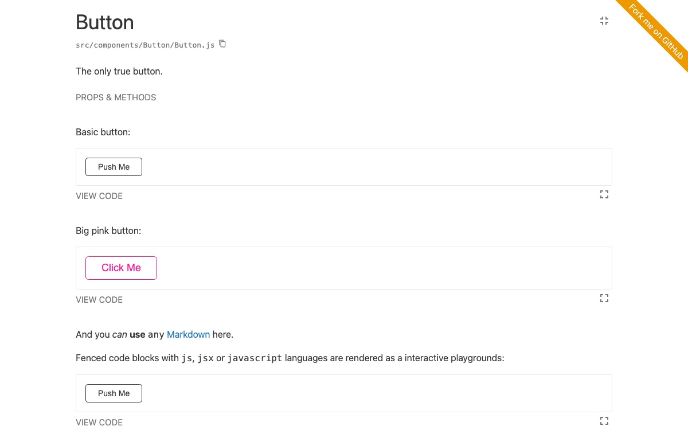

# Vite Styleguidist

**Isolated React component development environment with a living style guide, powered by Vite**

  

## About this fork

Vite Styleguidist is a maintained fork of [React Styleguidist](https://github.com/styleguidist/react-styleguidist). The original project has been inactive since 2025-01-07; its last release is `react-styleguidist@13.1.4`. This fork continues it under a new name so that the tool can keep up with current React, Node.js and bundler releases.

What changed compared to React Styleguidist 13.x:

- The style guide is compiled and served by [Vite](https://vite.dev/) instead of webpack. Your project doesn’t have to use Vite.
- The package is an ES module and ships compiled TypeScript.
- It requires **Node.js 22.12 or newer** (Node 23 is not supported; 24 and later are) and **React 18 or newer**.
- The configuration API (`styleguideComponents`, `theme`, `styles`, `sections`, `moduleAliases`, …) and the Markdown documentation format are unchanged, so existing style guides keep working with few edits.

It is not affiliated with or endorsed by the original React Styleguidist maintainers.

Read more in [About this fork](docs/Fork.md), or in the [compatibility and support policy](docs/Compatibility.md). **Upgrading from `react-styleguidist` 13.x?** See the [migration guide](docs/Migration.md).

## What it does

Vite Styleguidist is a component development environment with a hot reloaded dev server and a living style guide that you can share with your team. It lists component `propTypes` and shows live, editable usage examples based on Markdown files. Because it’s powered by Vite, JSX, TypeScript, CSS modules and static assets work out of the box, whatever bundler your app uses. Try the [basic example](examples/basic) to see it in action.

The documentation lives at [vite-styleguidist.github.io/vite-styleguidist](https://vite-styleguidist.github.io/vite-styleguidist/); the same pages are the Markdown files under [docs/](docs/). Try [the demo style guide](https://vite-styleguidist.github.io/vite-styleguidist/examples/basic/), built from [examples/basic](examples/basic).

## Usage

- **[Getting Started](docs/GettingStarted.md): install and run Styleguidist**
- [Documenting components](docs/Documenting.md): how to write documentation
- [Locating components](docs/Components.md): point Styleguidist to your React components
- [Configuring Vite](docs/Vite.md): tell Styleguidist how to load your code
- [Cookbook](docs/Cookbook.md): how to solve common tasks with Styleguidist

## Advanced documentation

- [Configuration](docs/Configuration.md)
- [CLI commands and options](docs/CLI.md)
- [Node.js API](docs/API.md)
- [Migrating from react-styleguidist 13.x](docs/Migration.md)
- [Compatibility and support policy](docs/Compatibility.md)
- [Working with third-party libraries](docs/Thirdparties.md)
- [All documentation](docs/Readme.md)

## Examples

- [Basic style guide](examples/basic)
- [Style guide with sections](examples/sections)
- [Style guide with customized styles](examples/customised)
- [Style guide with custom dev server endpoints](examples/express)
- [Style guide with a custom theme](examples/themed)
- [Style guide reusing the project’s Vite config](examples/vite)
- [Preact](examples/preact)
- [Styled-components and TypeScript](examples/styled-components)

## Showcase

Public style guides built with React Styleguidist (inherited from the original project; links checked on 2026-09-06):

- [Semantic UI Components for React](https://hallister.github.io/semantic-react/)
- [Dialog Components](https://dialogs.github.io/dialog-web-components/)
- [Bulma Components](https://bokuweb.github.io/re-bulma/)
- [Yammer Components](https://microsoft.github.io/YamUI/)

Using Vite Styleguidist for a public style guide? Tell us in [Discussions](https://github.com/vite-styleguidist/vite-styleguidist/discussions) and we’ll add it here.

## Integration with other tools

- Vite: your `vite.config.js` is reused automatically, see [Configuring Vite](docs/Vite.md)
- Next.js, webpack and other bundlers: nothing to configure, see [Configuring Vite](docs/Vite.md)
- Vue: [Vue Styleguidist](https://github.com/vue-styleguidist/vue-styleguidist) was the Vue port of React Styleguidist. Its repository is archived and it is no longer maintained.

## Third-party tools

These tools were written for the webpack-based React Styleguidist and have not been updated for this fork. Check their status before relying on them:

- [snapguidist](https://github.com/styleguidist/snapguidist): snapshot testing for React Styleguidist. Last published in August 2018, unmaintained.
- [react-styleguidist-visual](https://github.com/unindented/react-styleguidist-visual): automated visual testing using Puppeteer and pixelmatch. Last published in September 2019, unmaintained.
- [styleguidist-scrapper](https://github.com/livechat/styleguidist-scrapper): scraper script for the documentation generated by React Styleguidist. Last published in November 2017, unmaintained; it works on the generated HTML and hasn’t been tested against this fork.

## Resources

- [The Dream of Styleguide Driven Development](https://www.youtube.com/watch?v=JjXnmhNW8Cs), a talk by [Sara Vieira](https://github.com/saravieira)
- [Interview with Artem Sapegin](https://survivejs.com/blog/styleguidist-interview/) about React Styleguidist

## Change log

Release notes are published on the [Releases page](https://github.com/vite-styleguidist/vite-styleguidist/releases). Releases for the original project (up to 13.1.4) live in [its repository](https://github.com/styleguidist/react-styleguidist/releases).

## Contributing

Everyone is welcome to contribute. Please take a moment to read the [contributing guidelines](.github/CONTRIBUTING.md) and the [developer guide](docs/Development.md). [MAINTAINERS.md](MAINTAINERS.md) explains who maintains the project, what to expect, and how to get involved beyond pull requests.

## Thanks

Vite Styleguidist exists because of the people who built React Styleguidist. Thank you to [Artem Sapegin](https://github.com/sapegin), who created the project and maintained it for many years, and to [everyone who contributed](https://github.com/styleguidist/react-styleguidist/graphs/contributors) to it. The original React Styleguidist logo was designed by [Sara Vieira](https://github.com/SaraVieira) and [Andrey Okonetchnikov](https://github.com/okonet); this fork doesn’t reuse it.

## License

MIT License, see the included [License.md](License.md) file. The original copyright notice is preserved.
